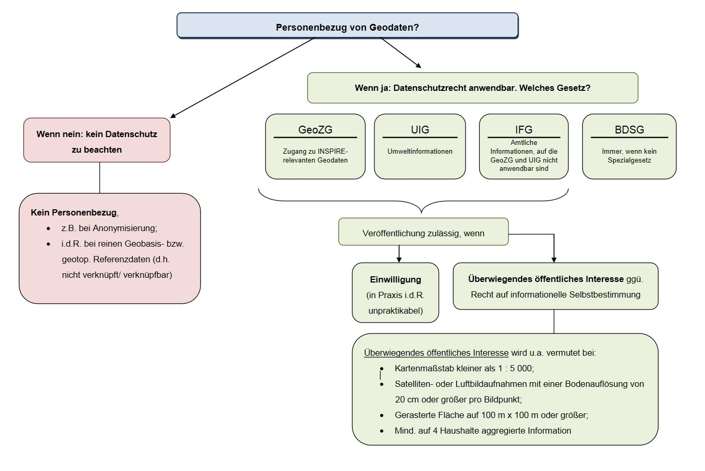

# Datenschutz und Geodaten
Informationen und Ressourcen rund um das Thema Datenschutz bei Geodaten

## Behördenleitfaden zum Datenschutz bei Geodaten und -diensten
### Geodatenzugangsgesetz (GeoZG)
Das Geodatenzugangsgesetz regelt den Zugang zu INSPIRE-relevanten Geodaten

### Umweltinformationsgesetz (UIG)
Das UIG gilt unmittelbar in den Fällen, in denen Anfragen zu Umweltinformationen im Rahmen des UIG zu bearbeiten sind. Ein Antrag auf Zugang zu Umweltinformationen ist dann abzulehnen, soweit durch das Bekanntgeben der Informationen personenbezogene Daten offenbart und dadurch Interessen der Betroffenen erheblich beeinträchtigt würden, es sei denn, die Betroffenen haben zugestimmt oder das „öffentliche Interesse“ an der Bekanntgabe überwiegt.

### Informationsfreiheitsgesetz (IFG)
Das IFG regelt den Anspruch des Einzelnen auf Zugang zu amtlichen Informationen des Bundes. 

> Datenschutzrechtliche Relevanz entsteht dabei vielfach erst durch die mit der digitalen Erfassung, Aufbereitung und Bereitstellung der Geodaten bestehenden Verknüpfungsmöglichkeiten mit anderen Informationen, insbesondere Identifikationsdaten einer Person. Eine klare Linie zur Bestimmung des Personenbezugs von Geodaten hat sich bislang weder in der Rechtsprechung noch in der Literatur durchgesetzt. Gerade bei Geodaten sind die Übergänge fließend und hängen oft vom Detaillierungsgrad der Information ab.

> Höchstrichterliche Rechtsprechung zur Persönlichkeitsrelevanz von Geoinformationen gibt es bisher nicht. Um für die Praxis Standardfälle festzulegen, in denen der Eingriff in das allgemeine Persönlichkeitsrecht hinzunehmen ist, weil die Geodaten nur einen mittelbaren und entfernten Personenbezug haben und die Rückschlüsse auf eine konkrete Person nur gering ausgeprägt sind, werden für die Bundesverwaltung konkrete Auflösungsschwellen empfohlen. Im Hinblick auf die nur geringe Wahrscheinlichkeit und Intensität von möglichen Persönlichkeitsverletzungen ist nach der Kontrollpraxis des Bundesbeauftragten für den Datenschutz und die Informationsfreiheit in der Regel davon auszugehen, dass das öffentliche Interesse überwiegt bei Daten, die eine der folgenden Auflösungsschwellen erfüllen:
> 
> 1. Karten mit einem Maßstab kleiner als 1:5000
> 2. Satelliten- oder Luftbildinformationen mit einer Bodenauflösung von 20 > cm oder größer pro Bildpunkt
> 3. Eine gerasterte Fläche auf 100 m x 100 m oder größer
> 4. Mindestens auf vier Haushalte aggregierte Informationen.

